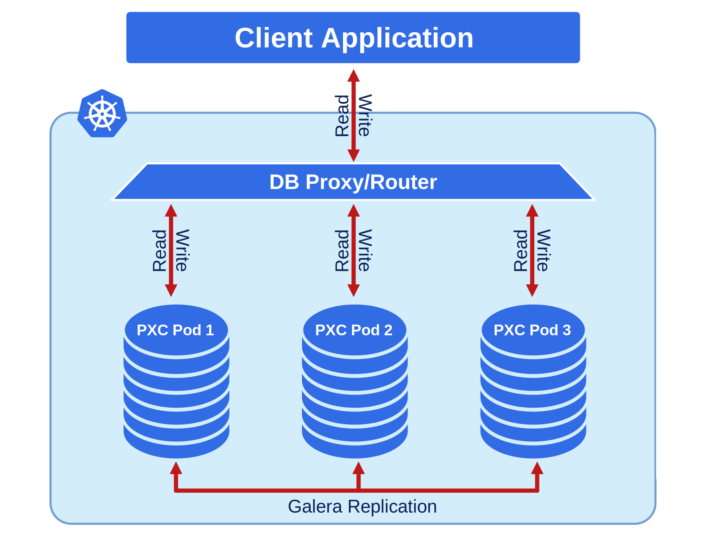

# Architecture

*Percona XtraDB Cluster* integrates *Percona Server for MySQL* running
    with the XtraDB storage engine, and *Percona XtraBackup* with the
*Galera library* to enable synchronous multi-primary replication.

The design of the Operator is highly bound to the
Percona XtraDB Cluster high availability implementation, which in its turn can
be briefly described with the following diagram.

Being a regular MySQL Server instance, each node contains the same set
of data synchronized accross nodes. The recommended configuration is to
have at least 3 nodes. In a basic setup with this amount of nodes,
Percona XtraDB Cluster provides high availability, continuing to
function if you take any of the nodes down. Additionally load balancing
can be achieved with the HAProxy router, which accepts incoming traffic
from MySQL clients and forwards it to backend MySQL servers.

To provide high availability operator uses [node affinity](https://kubernetes.io/docs/concepts/configuration/assign-pod-node/#affinity-and-anti-affinity)
to run Percona XtraDB Cluster instances on separate worker nodes if possible. If
some node fails, the pod with it is automatically re-created on another node.

To provide data storage for stateful applications, Kubernetes uses
Persistent Volumes. A *PersistentVolumeClaim* (PVC) is used to implement
the automatic storage provisioning to pods. If a failure occurs, the
Container Storage Interface (CSI) should be able to re-mount storage on
a different node. The PVC StorageClass must support this feature.

The Operator functionality extends the Kubernetes API with
*PerconaXtraDBCluster* object, and it is implemented as a golang
application. Each *PerconaXtraDBCluster* object maps to one separate Percona
XtraDB Cluster setup. The Operator listens to all events on the created objects.
When a new PerconaXtraDBCluster object is created, or an existing one undergoes
some changes or deletion, the operator automatically
creates/changes/deletes all needed Kubernetes objects with the
appropriate settings to provide a proper Percona XtraDB Cluster operation.