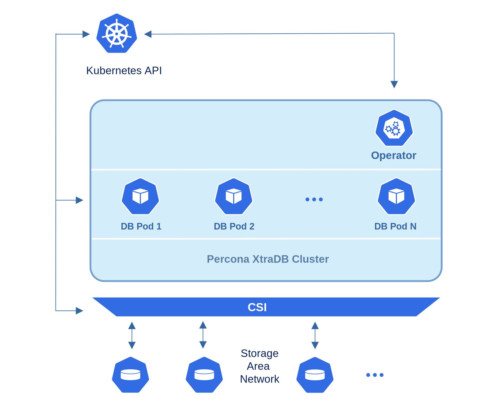

# Архитектура

*Percona XtraDB Cluster* интегрирует *Percona Server для MySQL*, работающий
с движком хранения XtraDB, и *Percona XtraBackup* с библиотекой *Galera* для внедрения синхронной репликации с несколькими основными узлами.

Дизайн оператора тесно связан с реализацией высокой доступности *Percona XtraDB Cluster*, которая в свою очередь может быть кратко описана с помощью следующей схемы.

Каждый узел, будучи обычным экземпляром MySQL Server, содержит один и тот же набор данных, синхронизированных между узлами. Рекомендуемая конфигурация — иметь как минимум 3 узла. В базовой настройке с таким количеством узлов *Percona XtraDB Cluster* обеспечивает высокую доступность, продолжая функционировать, если вы отключите любой из узлов. Кроме того, балансировка нагрузки может быть достигнута с помощью маршрутизатора HAProxy, который принимает входящий трафик от клиентов MySQL и перенаправляет его на серверы MySQL на заднем плане.

Для обеспечения высокой доступности оператор использует [узловую аффинность](https://kubernetes.io/docs/concepts/configuration/assign-pod-node/#affinity-and-anti-affinity)
для запуска экземпляров *Percona XtraDB Cluster* на отдельных рабочих узлах, если это возможно. Если какой-либо узел выходит из строя, под с ним автоматически пересоздается на другом узле.

Для обеспечения хранения данных для состояния приложений, Kubernetes использует
Постоянные тома. *PersistentVolumeClaim* (PVC) используется для реализации
автоматического предоставления хранилища для подов. Если возникает сбой, интерфейс хранения контейнеров (CSI) должен иметь возможность повторно подключить хранилище на другом узле. *PVC StorageClass* должен поддерживать эту функцию.

Функциональность оператора расширяет API Kubernetes объектом *PerconaXtraDBCluster*, который реализован как приложение на golang. Каждый объект *PerconaXtraDBCluster* отображает одну отдельную настройку *Percona XtraDB Cluster*. Оператор отслеживает все события на созданных объектах. Когда создается новый объект *PerconaXtraDBCluster*, или существующий подвергается изменениям или удалению, оператор автоматически
создает/изменяет/удаляет все необходимые объекты Kubernetes с
соответствующими настройками для обеспечения правильной работы *Percona XtraDB Cluster*.
