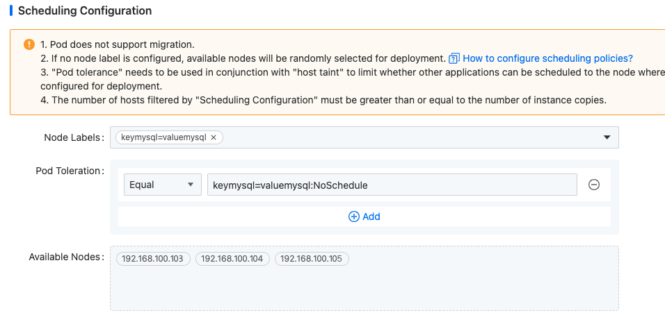

# Конфигурация расписания

Политика расписания позволяет экземплярам запускаться на определенных узлах и эффективно предотвращает планирование других приложений на этих узлах, обеспечивая высокую доступность экземпляров.

## Обзор сценария

- PXC развернут в выделенном бизнес-кластере, и клиенты хотят, чтобы различные экземпляры PXC работали на разных узлах для облегчения обслуживания и более быстрой локализации неисправностей.

- PXC развернут в существующем бизнес-кластере, и клиенты хотят развернуть экземпляры PXC на определенных узлах, предотвращая планирование других приложений на тех же узлах.

Оба сценария могут быть реализованы путем настройки **Меток узлов** и **Допусков Pod** в разделе **Конфигурация расписания** на странице создания экземпляра.

Этот раздел демонстрирует, как запустить экземпляры PXC на различных выбранных узлах. Назначенные узлы следующие:

| Компонент      | Указанные узлы                               |
| -------------- | -------------------------------------------- |
| **Redis**      | 192.168.100.101 192.168.100.102             |
| **MySQL-PXC**  | 192.168.100.103 192.168.100.104 192.168.100.105 |

## Предварительные требования

1. Администратор платформы должен **обновить метки узлов** на указанных узлах, чтобы программное обеспечение могло быть запланировано на назначенные узлы на основе меток.

2. Администратор платформы должен **установить загрязнения** на указанных узлах, чтобы обеспечить возможность планирования программного обеспечения на загрязненных узлах на основе допусков, предотвращая планирование других приложений на этих узлах.

Вы можете настроить узлы и загрязнения в зависимости от фактических требований.

Администратор платформы уже установил загрязнения и метки узлов в центре платформы с следующими конфигурациями:

| Узел                                                 | Метка узла          | Загрязнение узла                   |
| --------------------------------------------------- | ------------------- | ---------------------------------- |
| **192.168.100.101 192.168.100.102**                 | keyredis=valueredis | keyredis=valueredis:NoSchedule     |
| **192.168.100.103 192.168.100.104 192.168.100.105** | keymysql=valuemysql | keymysql=valuemysql:NoSchedule     |

## Объяснение конфигурации

- **Загрязнение**: атрибут ключ-значение, применяемый к узлу, который предотвращает планирование Pods на нем, если у Pod нет соответствующего допуска.

- **Допуск**: атрибут ключ-значение у Pod, который позволяет ему терпеть определенные загрязнения узлов, обеспечивая планирование Pod только на узлы, которые он может терпеть.

Загрязнения и допуска поддерживают параметр `effect` с синтаксисом `key=value:effect`. Параметр `effect` определяет уровень исключения для Pod и включает три типа:

| Тип эффекта          | Описание                                                                                                                                                                                                                             |
| -------------------- | --------------------------------------------------------------------------------------------------------------------------------------------------------------------------------------------------------------------------------------- |
| **NoSchedule**       | Новые Pods, которые не терпят это загрязнение, не могут быть запланированы на узле. Это строгий ограничение, но существующие Pods на узле остаются нетронутыми.                                                                    |
| **PreferNoSchedule** | Мягкая версия NoSchedule, когда новые Pods, которые не терпят это загрязнение, предпочтительно не должны быть запланированы на узле, но их все равно могут там запланировать, если нет других доступных узлов. Существующие Pods остаются нетронутыми. |
| **NoExecute**        | Новые Pods, которые не терпят это загрязнение, не могут быть запланированы на узле. Дополнительно, если существующий Pod больше не соответствует критериям допуска-загрязнения из-за изменений в загрязнении узла или допуска Pod, он будет выселен.  |

При определении допусков для Pod поддерживаются два оператора:

| Оператор   | Описание                                                                                        |
| ---------- | -------------------------------------------------------------------------------------------------- |
| **Равно**  | Допуск Pod должен точно соответствовать ключу, значению и эффекту загрязнения узла.                   |
| **Существует** | Допуск Pod должен совпадать с ключом и эффектом загрязнения узла, но поле значения может быть пустым. |

## Процедура конфигурации

### Создание экземпляра MySQL с конфигурацией расписания

1. В левой панели навигации нажмите **MySQL-PXC**.

2. Нажмите **Создать экземпляр MySQL-PXC**.

3. Завершите настройку параметров. В разделе **Конфигурация расписания** выберите метку узла и загрязнение на основе указанных узлов.

   

4. Нажмите **Создать**. Pod экземпляра MySQL будет запланирован на узлы 192.168.100.103, 192.168.100.104 и 192.168.100.105.

## Проверка

Вы можете проверить, что экземпляры MySQL работают на указанных узлах, перейдя в **Контейнерная платформа** > **Вычислительные компоненты** > **Контейнерные группы**.
