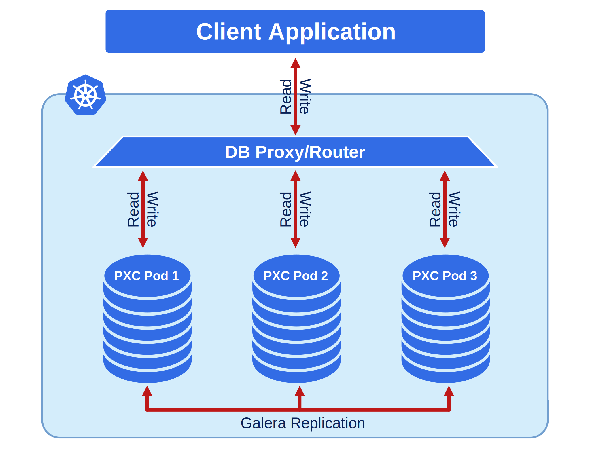

# 架构
Percona XtraDB Cluster (PXC) 是一款开源解决方案，旨在为 MySQL 数据库提供高可用性和可扩展性。它将 Percona Server 与 Galera 库集成，实现同步多主复制，确保所有节点之间的数据一致性。

## Percona XtraDB Cluster 的特性

| 特性                             | 详细信息                                                                                                   |
| -------------------------------- | -------------------------------------------------------------------------------------------------------- |
| **同步复制**                     | 数据在所有节点上同时写入，或在单个节点出现故障的情况下完全不写入。                                        |
| **多源复制**                     | 任何节点都可以触发数据更新。                                                                             |
| **真正的并行复制**               | 在从节点上，多个线程执行行级复制。                                                                       |
| **自动节点配置**                 | 只需添加一个节点，系统将自动进行同步。                                                                   |
| **数据一致性**                   | 不再有不同步的节点。                                                                                     |
| **PXC 严格模式**                 | 避免使用技术预览功能和不受支持的功能。                                                                   |
| **优化性能**                     | Percona XtraDB Cluster 的性能经过优化，以适应不断增长的生产工作负载。                                   |

