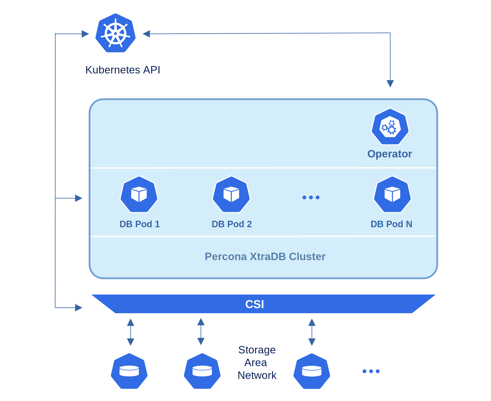

# 架构

*Percona XtraDB Cluster* 集成了运行于 XtraDB 存储引擎的 *Percona Server for MySQL* 以及 *Percona XtraBackup* 和 *Galera library*，以实现同步多主复制。

操作员的设计与 Percona XtraDB Cluster 的高可用性实现密切相关，这一实现可以通过以下图表简要描述。

作为一个常规的 MySQL 服务器实例，每个节点包含在节点间同步的相同数据集。推荐配置至少包含 3 个节点。在基本设置中, 当节点数量达到此要求时，Percona XtraDB Cluster 提供高可用性，如果任何节点宕机，系统仍然可以继续运行。此外，可以通过 HAProxy 路由器实现负载均衡，HAProxy 接收来自 MySQL 客户端的流量并将其转发至后端的 MySQL 服务器。

为了提供高可用性，操作员使用 [node affinity](https://kubernetes.io/docs/concepts/configuration/assign-pod-node/#affinity-and-anti-affinity) 在可能的情况下在不同的工作节点上运行 Percona XtraDB Cluster 实例。如果某个节点发生故障，相关的 Pod 将自动在另一个节点上重新创建。

Kubernetes 使用持久卷为有状态应用程序提供数据存储。*PersistentVolumeClaim* (PVC) 用于实现对 Pods 的自动存储供给。如果发生故障，容器存储接口 (CSI) 应能够在不同的节点上重新挂载存储。PVC 的 StorageClass 必须支持此功能。

操作员功能扩展了 Kubernetes API，新增了 *PerconaXtraDBCluster* 对象，并作为 Golang 应用程序实现。每个 *PerconaXtraDBCluster* 对象映射到一个独立的 Percona XtraDB Cluster 设置。操作员监听所有已创建对象的事件。当创建新的 PerconaXtraDBCluster 对象，或现有对象发生更改或删除时，操作员将自动创建/更改/删除所有需要的 Kubernetes 对象，并设置适当的配置，以确保 Percona XtraDB Cluster 的正常运行。
