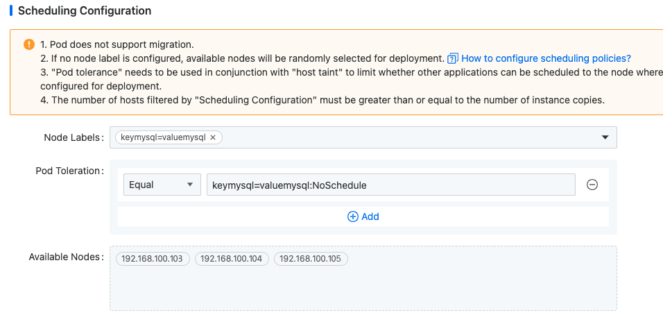

# 调度配置

调度策略允许实例在指定的节点上运行，有效地防止其他应用程序被调度到这些节点，从而确保实例的高可用性。

## 场景概述

- PXC 部署在一个专用业务集群中，客户希望不同的 PXC 实例运行在不同的节点上，以便于维护和更快的故障定位。

- PXC 在现有业务集群中部署，客户希望将 PXC 实例部署在指定的节点上，同时防止其他应用程序被调度到相同的节点。

这两种场景均可以通过在实例创建页面的 **调度配置** 部分配置 **节点标签** 和 **Pod 容忍** 来实现。

本节演示如何在不同的指定节点上运行 PXC 实例。指定的节点如下：

| 组件         | 指定节点                                       |
| ------------ | ----------------------------------------------- |
| **Redis**    | 192.168.100.101 192.168.100.102                |
| **MySQL-PXC**| 192.168.100.103 192.168.100.104 192.168.100.105 |

## 前提条件

1. 平台管理员必须**更新指定节点上的节点标签**，以便中间件能够根据标签调度到指定的节点。

2. 平台管理员必须**设置指定节点上的污点**，以确保中间件能够根据容忍调度到具有污点的节点，同时防止其他应用程序被调度到这些节点。

你可以根据实际需求配置节点和污点。

平台管理员已经在平台中心对节点的污点和标签进行如下配置：

| 节点                                               | 节点标签              | 节点污点                         |
| -------------------------------------------------- | --------------------- | -------------------------------- |
| **192.168.100.101 192.168.100.102**                | keyredis=valueredis   | keyredis=valueredis:NoSchedule   |
| **192.168.100.103 192.168.100.104 192.168.100.105**| keymysql=valuemysql   | keymysql=valuemysql:NoSchedule   |

## 配置说明

- **污点**：节点上的一个键值属性，阻止 Pods 在其上调度，除非 Pod 具有相应的容忍。

- **容忍**：Pods 上的一个键值属性，允许 Pods 忍受特定节点的污点，确保 Pods 仅调度到其可以忍受的节点。

污点和容忍支持 `effect` 参数，语法格式为 `key=value:effect`。`effect` 定义了 Pods 的排除级别，包括三种类型：

| 效果类型            | 描述                                                                                                                                                                                                                                |
| --------------------| ------------------------------------------------------------------------------------------------------------------------------------------------------------------------------------------------------------------------------------ |
| **NoSchedule**       | 不容忍此污点的新 Pods 不能在该节点上调度。这是一个严格约束，但节点上的现有 Pods 不受影响。                                                                                                                                           |
| **PreferNoSchedule** | NoSchedule 的软版本，不容忍此污点的新 Pods 应优先不在该节点上调度，但如果没有其他节点可调度，它们仍可能在此节点上调度。现有 Pods 不受影响。                                                                                           |
| **NoExecute**        | 不容忍此污点的新 Pods 不能在该节点上调度。此外，如果现有 Pods 不再符合污点-容忍标准（由于节点污点或 Pods 的容忍发生改变），它将被驱逐。                                                                                        |

在 Pods 上定义容忍时，支持两种运算符：

| 运算符   | 描述                                                                                           |
| -------- | ------------------------------------------------------------------------------------------------- |
| **Equal**  | Pods 的容忍必须与节点污点的键、值和效果完全匹配。                                                    |
| **Exists** | Pods 的容忍必须与节点污点的键和效果匹配，但值字段可以为空。                                           |

## 配置步骤

### 创建带有调度配置的 MySQL 实例

1. 在左侧导航面板中，点击 **MySQL-PXC**。

2. 点击 **创建 MySQL-PXC 实例**。

3. 完成参数配置。在 **调度配置** 部分，基于指定节点选择节点标签和污点。

   

4. 点击 **创建**。MySQL 实例 Pods 将调度到节点 192.168.100.103、192.168.100.104 和 192.168.100.105。

## 验证

你可以通过导航到 **容器平台** > **计算组件** > **容器组** 来验证 MySQL 实例是否在指定的节点上运行。
